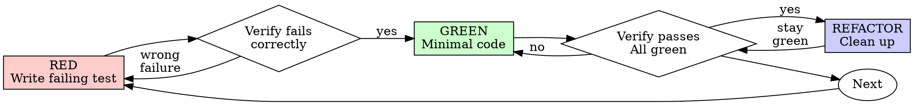

# Test-Driven Development (TDD)

## Overview

Write the test first. Watch it fail. Write minimal code to pass.

**Core principle:** If you didn't watch the test fail, you don't know if it tests the right thing.

**Violating the letter of the rules is violating the spirit of the rules.**

## When to Use

**Always:**
- New features
- Bug fixes
- Refactoring
- Behavior changes

**Exceptions (ask your human partner):**
- Throwaway prototypes
- Generated code
- Configuration files

Thinking "skip TDD just this once"? Stop. That's rationalization.

## The Iron Law

```
NO PRODUCTION CODE WITHOUT A FAILING TEST FIRST
```

Write code before the test? Delete it. Start over.

**No exceptions:**
- Don't keep it as "reference"
- Don't "adapt" it while writing tests
- Don't look at it
- Delete means delete

Implement fresh from tests. Period.

## Red-Green-Refactor



### RED - Write Failing Test

Write one minimal test showing what should happen.

<Good>
```typescript
test('retries failed operations 3 times', async () => {
  let attempts = 0;
  const operation = () => {
    attempts++;
    if (attempts < 3) throw new Error('fail');
    return 'success';
  };

  const result = await retryOperation(operation);

  expect(result).toBe('success');
  expect(attempts).toBe(3);
});
```
Clear name, tests real behavior, one thing
</Good>

<Bad>
```typescript
test('retry works', async () => {
  const mock = jest.fn()
    .mockRejectedValueOnce(new Error())
    .mockRejectedValueOnce(new Error())
    .mockResolvedValueOnce('success');
  await retryOperation(mock);
  expect(mock).toHaveBeenCalledTimes(3);
});
```
Vague name, tests mock not code
</Bad>

**Requirements:**
- One behavior
- Clear name
- Real code (no mocks unless unavoidable)

### Verify RED - Watch It Fail

**MANDATORY. Never skip.**

```bash
npm test path/to/test.test.ts
```

Confirm:
- Test fails (not errors)
- Failure message is expected
- Fails because feature missing (not typos)

**Test passes?** You're testing existing behavior. Fix test.

**Test errors?** Fix error, re-run until it fails correctly.

### GREEN - Minimal Code

Write simplest code to pass the test.

<Good>
```typescript
async function retryOperation<T>(fn: () => Promise<T>): Promise<T> {
  for (let i = 0; i < 3; i++) {
    try {
      return await fn();
    } catch (e) {
      if (i === 2) throw e;
    }
  }
  throw new Error('unreachable');
}
```
Just enough to pass
</Good>

<Bad>
```typescript
async function retryOperation<T>(
  fn: () => Promise<T>,
  options?: {
    maxRetries?: number;
    backoff?: 'linear' | 'exponential';
    onRetry?: (attempt: number) => void;
  }
): Promise<T> {
  // YAGNI
}
```
Over-engineered
</Bad>

Don't add features, refactor other code, or "improve" beyond the test.

### Verify GREEN - Watch It Pass

**MANDATORY.**

```bash
npm test path/to/test.test.ts
```

Confirm:
- Test passes
- Other tests still pass
- Output pristine (no errors, warnings)

**Test fails?** Fix code, not test.

**Other tests fail?** Fix now.

### REFACTOR - Clean Up

After green only:
- Remove duplication
- Improve names
- Extract helpers

Keep tests green. Don't add behavior.

### Repeat

Next failing test for next feature.

## Good Tests

| Quality | Good | Bad |
|---------|------|-----|
| **Minimal** | One thing. "and" in name? Split it. | `test('validates email and domain and whitespace')` |
| **Clear** | Name describes behavior | `test('test1')` |
| **Shows intent** | Demonstrates desired API | Obscures what code should do |

## Why Order Matters

**"I'll write tests after to verify it works"**

Tests written after code pass immediately. Passing immediately proves nothing:
- Might test wrong thing
- Might test implementation, not behavior
- Might miss edge cases you forgot
- You never saw it catch the bug

Test-first forces you to see the test fail, proving it actually tests something.

**"I already manually tested all the edge cases"**

Manual testing is ad-hoc. You think you tested everything but:
- No record of what you tested
- Can't re-run when code changes
- Easy to forget cases under pressure
- "It worked when I tried it" ≠ comprehensive

Automated tests are systematic. They run the same way every time.

**"Deleting X hours of work is wasteful"**

Sunk cost fallacy. The time is already gone. Your choice now:
- Delete and rewrite with TDD (X more hours, high confidence)
- Keep it and add tests after (30 min, low confidence, likely bugs)

The "waste" is keeping code you can't trust. Working code without real tests is technical debt.

**"TDD is dogmatic, being pragmatic means adapting"**

TDD IS pragmatic:
- Finds bugs before commit (faster than debugging after)
- Prevents regressions (tests catch breaks immediately)
- Documents behavior (tests show how to use code)
- Enables refactoring (change freely, tests catch breaks)

"Pragmatic" shortcuts = debugging in production = slower.

**"Tests after achieve the same goals - it's spirit not ritual"**

No. Tests-after answer "What does this do?" Tests-first answer "What should this do?"

Tests-after are biased by your implementation. You test what you built, not what's required. You verify remembered edge cases, not discovered ones.

Tests-first force edge case discovery before implementing. Tests-after verify you remembered everything (you didn't).

30 minutes of tests after ≠ TDD. You get coverage, lose proof tests work.

## Common Rationalizations

| Excuse | Reality |
|--------|---------|
| "Too simple to test" | Simple code breaks. Test takes 30 seconds. |
| "I'll test after" | Tests passing immediately prove nothing. |
| "Tests after achieve same goals" | Tests-after = "what does this do?" Tests-first = "what should this do?" |
| "Already manually tested" | Ad-hoc ≠ systematic. No record, can't re-run. |
| "Deleting X hours is wasteful" | Sunk cost fallacy. Keeping unverified code is technical debt. |
| "Keep as reference, write tests first" | You'll adapt it. That's testing after. Delete means delete. |
| "Need to explore first" | Fine. Throw away exploration, start with TDD. |
| "Test hard = design unclear" | Listen to test. Hard to test = hard to use. |
| "TDD will slow me down" | TDD faster than debugging. Pragmatic = test-first. |
| "Manual test faster" | Manual doesn't prove edge cases. You'll re-test every change. |
| "Existing code has no tests" | You're improving it. Add tests for existing code. |

## Red Flags - STOP and Start Over

- Code before test
- Test after implementation
- Test passes immediately
- Can't explain why test failed
- Tests added "later"
- Rationalizing "just this once"
- "I already manually tested it"
- "Tests after achieve the same purpose"
- "It's about spirit not ritual"
- "Keep as reference" or "adapt existing code"
- "Already spent X hours, deleting is wasteful"
- "TDD is dogmatic, I'm being pragmatic"
- "This is different because..."

**All of these mean: Delete code. Start over with TDD.**

## Example: Bug Fix

**Bug:** Empty email accepted

**RED**
```typescript
test('rejects empty email', async () => {
  const result = await submitForm({ email: '' });
  expect(result.error).toBe('Email required');
});
```

**Verify RED**
```bash
$ npm test
FAIL: expected 'Email required', got undefined
```

**GREEN**
```typescript
function submitForm(data: FormData) {
  if (!data.email?.trim()) {
    return { error: 'Email required' };
  }
  // ...
}
```

**Verify GREEN**
```bash
$ npm test
PASS
```

**REFACTOR**
Extract validation for multiple fields if needed.

## Verification Checklist

Before marking work complete:

- [ ] Every new function/method has a test
- [ ] Watched each test fail before implementing
- [ ] Each test failed for expected reason (feature missing, not typo)
- [ ] Wrote minimal code to pass each test
- [ ] All tests pass
- [ ] Output pristine (no errors, warnings)
- [ ] Tests use real code (mocks only if unavoidable)
- [ ] Edge cases and errors covered

Can't check all boxes? You skipped TDD. Start over.

## When Stuck

| Problem | Solution |
|---------|----------|
| Don't know how to test | Write wished-for API. Write assertion first. Ask your human partner. |
| Test too complicated | Design too complicated. Simplify interface. |
| Must mock everything | Code too coupled. Use dependency injection. |
| Test setup huge | Extract helpers. Still complex? Simplify design. |

## Debugging Integration

Bug found? Write failing test reproducing it. Follow TDD cycle. Test proves fix and prevents regression.

Never fix bugs without a test.

## Testing Anti-Patterns

When adding mocks or test utilities, read @testing-anti-patterns.md to avoid common pitfalls:
- Testing mock behavior instead of real behavior
- Adding test-only methods to production classes
- Mocking without understanding dependencies

## Final Rule

```
Production code → test exists and failed first
Otherwise → not TDD
```

No exceptions without your human partner's permission.

---
### Merged from ZES-tdd

---
name: zes-tdd
description: Test-driven development for ZES — write tests before implementation. Covers dashboard Python, agent Node.js, and shell scripts.
metadata:
  origin: ZES
  adapted_from: ECC
  version: 1.0
---

# ZES TDD Workflow

Apply test-driven development to ZES system: dashboard_v4.py, agent-server.js, MCP servers, backup scripts.

## When to Activate

- Adding features to dashboard or agent UI
- Creating new MCP tools or API endpoints
- Modifying service management scripts
- Refactoring existing ZES code

## Workflow

### Step 1: Write Test First
```python
# Example: test dashboard API
def test_api_status_returns_services():
    response = http_get("http://localhost:8083/api/status")
    assert response.status == 200
    data = json.loads(response.body)
    assert "services" in data
    assert "providers" in data
```

### Step 2: Run Tests (should fail)
```bash
python3 ~/Zes-System/scripts/run-tests.py
```

### Step 3: Implement
```python
class ZESHandler:
    def _send_json(self, data, code=200):
        # Minimal implementation to pass test
        ...
```

### Step 4: Verify
```bash
python3 ~/Zes-System/scripts/run-tests.py  # Should pass
python3 ~/Zes-System/scripts/run-evals.py  # Health check
```

## Coverage Targets
- Python services: 80%+ line coverage
- JavaScript/Node: 70%+ line coverage
- Shell scripts: manual test for each exit path
- Critical paths: 100% (service restart, API auth, backup/restore)


---
### Merged from ZES-tdd-workflow

---
name: zes-tdd-workflow
description: Test-driven development for ZES services — dashboard, 9Router, Hermes, MCP scripts. Write tests first, then implement.
---

# ZES TDD Workflow

Apply test-driven development to ZES system services: dashboard Python code, shell scripts, MCP servers, and 9Router configs.

## When to Activate

- Writing or modifying ZES service code
- Adding API endpoints to dashboard
- Creating new scripts or cron jobs
- Refactoring existing ZES infrastructure code

## Core Principles

### 1. Tests BEFORE Code
Write the test first, then implement the code to make it pass.

### 2. Coverage Requirements
- Minimum 80% coverage for Python/TypeScript code
- All edge cases covered
- Error scenarios tested

### 3. Test Types for ZES

#### Unit Tests
```python
# Test dashboard service card rendering
def test_service_card_running():
    svc = {"id": "codex", "name": "Codex", "status": "running", "port": 5900}
    card = render_service_card(svc)
    assert "● Up" in card
    assert "5900" in card
```

#### Integration Tests
```bash
# Test 9Router API responds
response=$(curl -s http://localhost:20128/api/providers)
echo "$response" | python3 -c "import sys,json; d=json.load(sys.stdin); assert len(d['connections']) > 0"
```

#### Health Check Tests
```bash
# Test all ZES services respond
for svc in r9 hermes codex; do
  port_map="r9:20128 hermes:8787 codex:5900"
  port=$(echo $port_map | grep -o "$svc:[0-9]*" | cut -d: -f2)
  if curl -s http://localhost:$port > /dev/null 2>&1; then
    echo "PASS: $svc on :$port"
  else
    echo "FAIL: $svc on :$port"
  fi
done
```

## TDD Workflow

### Step 1: Write the Failing Test
```python
# tests/test_dashboard_api.py
def test_status_endpoint():
    import urllib.request
    resp = urllib.request.urlopen("http://localhost:8083/api/status")
    assert resp.status == 200
    data = json.loads(resp.read())
    assert "services" in data
```

### Step 2: Run — It Should Fail
```bash
pytest tests/test_dashboard_api.py -v
# Expected: FAIL (endpoint not implemented yet)
```

### Step 3: Implement
```python
# dashboard_v3.py
class DashboardHandler:
    def do_GET(self):
        if self.path == '/api/status':
            self.send_response(200)
            self.send_header('Content-Type', 'application/json')
            self.wfile.write(json.dumps(get_status()).encode())
```

### Step 4: Run — It Should Pass
```bash
pytest tests/test_dashboard_api.py -v
# Expected: PASS
```

## ZES-Specific Testing Patterns

### Testing Shell Scripts
```bash
# Unit test for a shell function
test_port_check() {
  local result=$(ss -tlnp 2>/dev/null | grep -c ":5900")
  if [ "$result" -eq 1 ]; then
    echo "PASS: port 5900 is listening"
  else
    echo "FAIL: port 5900 not found"
  fi
}
```

### Testing MCP Tools
```python
def test_mcp_tool_call():
    import subprocess
    result = subprocess.run(
        ["sv", "status", "zeschrome-mcp"],
        capture_output=True, text=True
    )
    assert "run:" in result.stdout
```

## Best Practices

1. **Test what users/agents see**, not internal state
2. **One assertion per test** — focus on single behavior
3. **Mock external services** — don't depend on live 9Router in unit tests
4. **Test error paths** — what happens when a service is down?
5. **Keep tests fast** — health check tests < 5s
6. **CI gate** — run tests before deploying dashboard changes

## Common ZES Mistakes to Avoid

```python
# FAIL: Testing implementation details
assert dashboard._services_cache[0]["id"] == "codex"

# PASS: Testing user-visible behavior
resp = client.get("/api/status")
assert resp.json["services"][0]["id"] == "codex"
```

**Remember**: Tests are the safety net that lets you refactor ZES services confidently.

---
### Merged from ZES-testing

---
name: zes-testing
description: "Test, verify, and debug ZES System services, proxy configurations, and API endpoints."
---

# ZES Testing

Use when validating changes to ZES services, testing proxy configurations, or debugging service failures.

## Default Rule

Prove the changed surface first. Do not reflexively test everything.

1. Inspect the diff and classify the change:
   - **Dashboard change**: Restart and check `/api/status` returns valid JSON
   - **Proxy/server change**: Verify target reachable, proxy returns 200, wrapper injection works
   - **Service config change** (run script): Restart service, check `sv status`, check port is listening
   - **Documentation only**: Verify format with a quick scan

## Service Verification

```bash
# 1. Check service is running
sv status /data/data/com.termux/files/usr/var/service/<name>

# 2. Check port is listening
ss -tlnp 2>/dev/null | grep <port>

# 3. Check HTTP health endpoint (if available)
curl -s http://localhost:<port>/health

# 4. Check service logs for errors
tail -10 /data/data/com.termux/files/var/log/<name>/current
```

## Proxy Verification (VS Code Mobile)

```bash
# Health endpoint
curl -s http://localhost:8001/health

# Proxy test - should return 200 (VS Code behind proxy)
curl -s -o /dev/null -w "%{http_code}" http://localhost:8001/

# Verify wrapper injection
curl -s http://localhost:8001/ | grep -c 'zes-mobile-bar'

# WebSocket proxy test
curl -s -o /dev/null -w "%{http_code}" http://localhost:8001/ | grep 200
```

## API Endpoint Testing

```bash
# Dashboard status
curl -s http://localhost:8083/api/status | python3 -m json.tool

# 9Router provider check
TOKEN=$(python3 -c "import hashlib;d=open('$HOME/.9router/machine-id').read().strip();s=open('$HOME/.9router/auth/cli-secret').read().strip();print(hashlib.sha256((d+'9r-cli-auth'+s).encode()).hexdigest()[:16])")
curl -s -H "x-9r-cli-token: $TOKEN" http://localhost:20128/api/providers | python3 -c "import sys,json; d=json.load(sys.stdin); print(f'Providers: {len(d.get(\"connections\",[]))}')"

# MCP server health
curl -s http://localhost:5901/health
```

## Debugging Common Issues

### Service won't start
1. Check run script syntax: `bash -n /path/to/run`
2. Check run script permissions: `ls -la /path/to/run`
3. Check for port conflicts: `ss -tlnp | grep <port>`
4. View full log: `cat /data/data/com.termux/files/var/log/<name>/current`

### Proxy returning errors
1. Check target service is running
2. Check proxy logs for error messages
3. Test target directly with curl
4. Check for WebSocket upgrade failures

### Wrapper not injecting
1. Check that HTML response contains `</body>` tag
2. Check that wrapper-head.html and wrapper-foot.html exist
3. Check content-type is text/html
4. Test with curl and grep for injected elements
